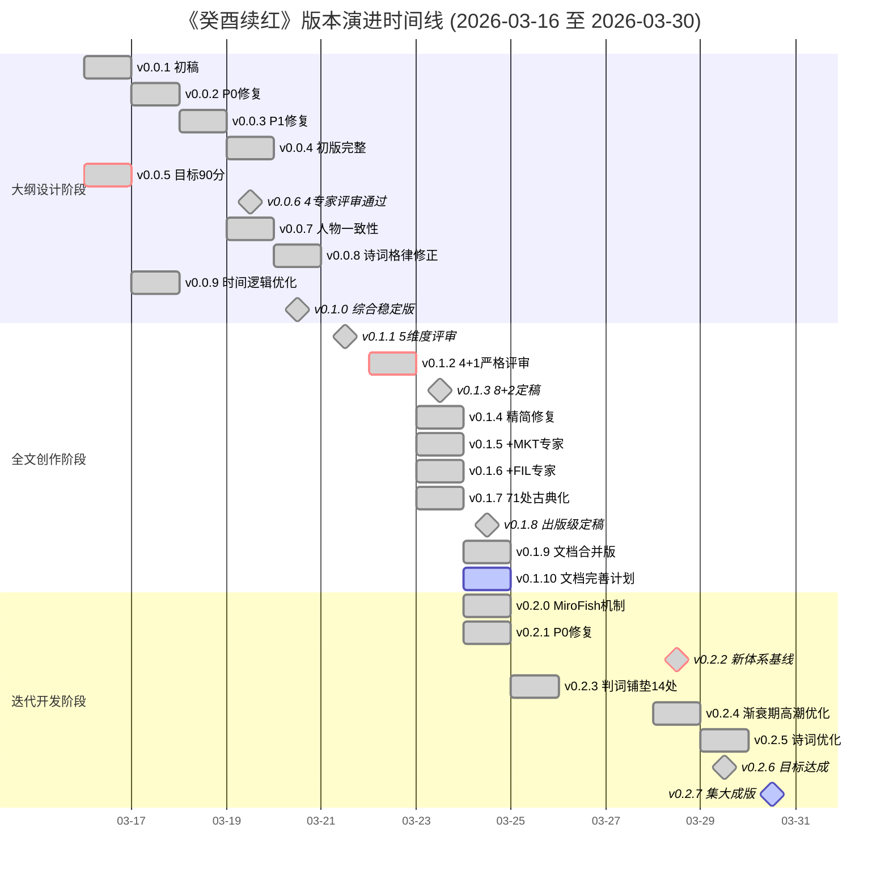
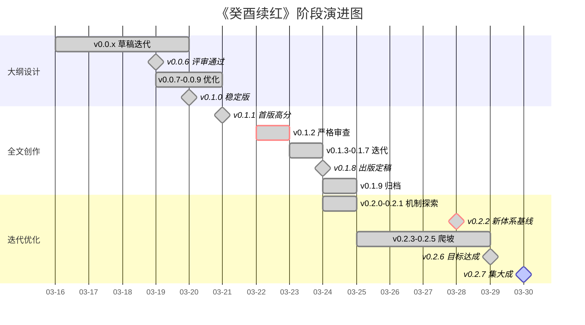
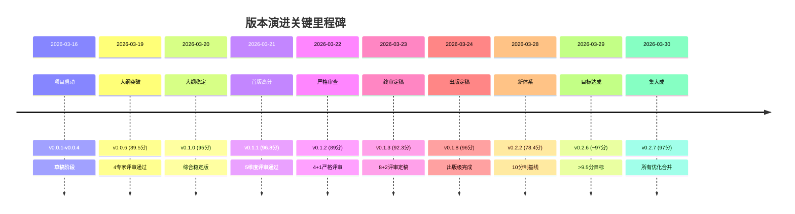
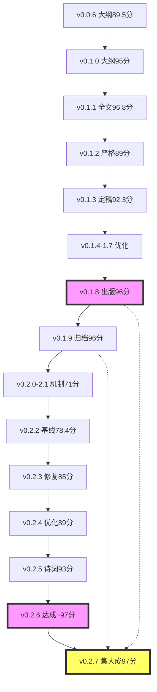

# 《癸酉续红》版本演进甘特图

> 使用Mermaid语法绘制，可在支持Mermaid的Markdown阅读器中渲染

---

## 详细甘特图（每版本一行）



---

## 简化甘特图（按阶段分组）



---

## 评分演进趋势图

```mermaid
xychart-beta
    title "版本评分演进趋势 (百分制)"
    x-axis [v0.0.5, v0.0.6, v0.0.8, v0.1.0, v0.1.1, v0.1.2, v0.1.3, v0.1.4, v0.1.7, v0.1.8, v0.2.2, v0.2.6, v0.2.7]
    y-axis "评分" 0 --> 100
    line [58, 89.5, 90, 95, 96.8, 89, 92.3, 93.5, 94.75, 96, 78.4, 97, 97]
    
    annotation 58, "起点"
    annotation 96.8, "首高"
    annotation 89, "严格"
    annotation 78.4, "新基"
    annotation 97, "目标"
```

---

## 关键节点标记



---

## 版本并行关系图



---

## 使用说明

### 在VSCode中查看
1. 安装 "Markdown Preview Mermaid Support" 插件
2. 按 `Ctrl+Shift+V` 预览

### 在GitHub中查看
GitHub原生支持Mermaid渲染，直接打开本文件即可

### 导出图片
使用 [Mermaid Live Editor](https://mermaid.live/) 粘贴代码导出

---

*生成日期: 2026-03-30*  
*关联文档: [VERSION_HISTORY.md](VERSION_HISTORY.md)*
